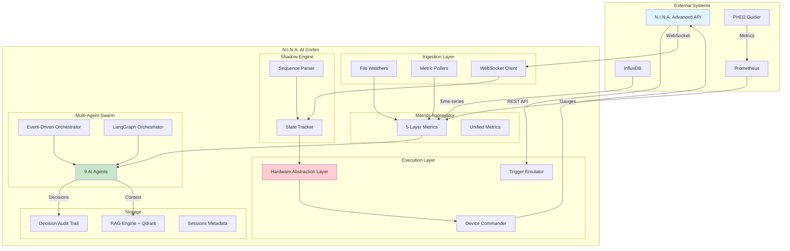

Создам полноценный README.md для проекта N.I.N.A. AI Cortex v5.0.

````markdown
# 🌌 N.I.N.A. AI Cortex v5.0

**Интеллектуальная когнитивная надстройка для астрономической обсерватории на базе N.I.N.A.**

[](https://www.python.org/downloads/)
[](https://fastapi.tiangolo.com/)
[](LICENSE)

N.I.N.A. AI Cortex — это автономная Multi-Agent AI система для управления астрономической обсерваторией. Система анализирует метрики качества в реальном времени, предсказывает проблемы оборудования, оптимизирует параметры съемки и обеспечивает безопасность через Hardware Abstraction Layer.

## 📋 Содержание

- [Возможности](#-возможности)
- [Архитектура](#-архитектура)
- [Быстрый старт](#-быстрый-старт)
- [Установка](#-установка)
- [Конфигурация](#-конфигурация)
- [Запуск](#-запуск)
- [API Documentation](#-api-documentation)
- [AI Агенты](#-ai-агенты)
- [Тестирование](#-тестирование)
- [Troubleshooting](#-troubleshooting)
- [Лицензия](#-лицензия)

## ✨ Возможности

### 🤖 Multi-Agent AI System

- **9 специализированных AI-агентов** с различными ролями и приоритетами
- **Dual Orchestrator**: Event-Driven + Hybrid LangGraph для сложных сценариев
- **Real-time мониторинг** метрик качества (HFR, FWHM, RMS, SNR)
- **Предиктивная аналитика** для предотвращения сбоев оборудования
- **RAG-система** для семантического поиска по истории сессий

### 🛡️ Safety & Reliability

- **Hardware Abstraction Layer (HAL)** — финальная валидация команд
- **Predictive HAL** — предсказание конфликтов (Meridian Flip, перегрев)
- **Pre-flight Checklist v2** — 20 gates в 6 категориях
- **Emergency Park** — автоматическая парковка при критических условиях
- **Decision Audit Trail** — полное логирование всех AI-решений

### 📊 5-Layer Metrics Architecture

1. **PRIMARY** (InfluxDB) — основные time-series метрики
2. **UNIQUE** (Prometheus) — уникальные метрики (AF R², sequence status)
3. **FALLBACK** (Prometheus) — резерв при недоступности InfluxDB
4. **EVENTS** (WebSocket) — события секвенсора в реальном времени
5. **ENRICHMENT** (File Watchers) — per-image детализация

### 🎯 Intelligent Automation

- **Autofocus optimization** — адаптивный интервал на основе тренда HFR
- **Exposure time adjustment** — расчёт оптимальной экспозиции по SNR
- **Dither strategy** — анализ качества дизеринга (CD², GFM, Voronoi)
- **Calibration management** — автоматическая проверка свежести мастеров
- **Target switching** — переключение целей при плохих условиях

### 🔌 Integrations

- **N.I.N.A. Advanced API** — полное управление через REST API
- **N.I.N.A. WebSocket** — real-time события секвенсора
- **PHD2** — интеграция с гидированием
- **Siril** — автоматизация preprocessing (заглушка)
- **Ollama** — локальный LLM (gemma4:31b-cloud + gemma4:e4b)

## 🏗️ Архитектура

### System Overview


````

### Multi-Agent Hierarchy

```
┌─────────────────────────────────────────────────────────────┐
│                    Orchestrator Layer                        │
│  ┌──────────────────┐  ┌──────────────────────────────────┐ │
│  │ Event-Driven     │  │ Hybrid LangGraph Orchestrator    │ │
│  │ Orchestrator     │  │ (Complex Workflows)              │ │
│  └────────┬─────────┘  └────────────┬─────────────────────┘ │
└───────────┼─────────────────────────┼───────────────────────┘
            │                         │
┌───────────┼─────────────────────────┼───────────────────────┐
│           ▼         Agent Layer     ▼                        │
│  ┌─────────────┐ ┌──────────┐ ┌─────────────┐ ┌─────────┐ │
│  │   Watcher   │ │ Guardian │ │Diagnostician│ │Strategist│ │
│  │  (HIGH)     │ │(CRITICAL)│ │   (HIGH)    │ │ (MEDIUM) │ │
│  └─────────────┘ └──────────┘ └─────────────┘ └─────────┘ │
│  ┌─────────────┐ ┌──────────┐ ┌─────────────┐            │
│  │   Auditor   │ │Calibrator│ │   Copilot   │            │
│  │   (LOW)     │ │  (LOW)   │ │   (INFO)    │            │
│  └─────────────┘ └──────────┘ └─────────────┘            │
└─────────────────────────────────────────────────────────────┘
            │
┌───────────┼─────────────────────────────────────────────────┐
│           ▼         Foundation Layer                         │
│  ┌─────────────┐ ┌──────────┐ ┌─────────────┐            │
│  │ Observatory │ │  Shadow  │ │    HAL      │            │
│  │   State     │ │  Engine  │ │ (Safety)    │            │
│  └─────────────┘ └──────────┘ └─────────────┘            │
└─────────────────────────────────────────────────────────────┘
```

### Agent Roles & Priorities

| Agent             | Priority | Role                                 | Trigger Events                              |
| ----------------- | -------- | ------------------------------------ | ------------------------------------------- |
| **Watcher**       | HIGH     | Мониторинг метрик, детекция аномалий | NEW_FRAME, PROMETHEUS_UPDATE                |
| **Guardian**      | CRITICAL | Безопасность оборудования            | ALERT (CRITICAL), LOG_EVENT                 |
| **Diagnostician** | HIGH     | Root cause analysis                  | ALERT (WARNING)                             |
| **Strategist**    | MEDIUM   | Оптимизация параметров               | LIVESTACK_STATUS, DIAGNOSTIC_RECOMMENDATION |
| **Auditor**       | LOW      | Post-mortem анализ                   | SEQUENCE_STOPPED                            |
| **Calibrator**    | LOW      | Управление мастер-кадрами            | NEW_FRAME, MASTERS_INDEXED                  |
| **Copilot**       | INFO     | Интерактивная помощь                 | SEQUENCE_ITEM_STARTED                       |

## 🚀 Быстрый старт

### Предварительные требования

1. **N.I.N.A.** с установленным плагином **Advanced API**
2. **Python 3.11+**
3. **Docker Desktop** (для Qdrant и InfluxDB)
4. **Ollama** (для локального LLM)

### Установка за 5 минут

```bash
# 1. Клонируйте репозиторий
git clone https://github.com/your-repo/nina-ai-cortex.git
cd nina-ai-cortex

# 2. Запустите установщик
install_deps.bat

# 3. Отредактируйте конфигурацию
# Откройте config/settings.yaml и укажите пути к N.I.N.A.

# 4. Загрузите LLM модели
ollama pull gemma4:31b-cloud
ollama pull gemma4:e4b
ollama pull nomic-embed-text

# 5. Запустите систему
start_cortex.bat
```

После запуска:

- **API Docs**: http://localhost:8000/docs
- **WebSocket**: ws://localhost:8000/ws
- **Metrics**: http://localhost:8000/metrics

## 📦 Установка

### Подробная инструкция

#### 1. Установка N.I.N.A. и плагинов

Убедитесь, что установлены следующие плагины N.I.N.A.:

**Обязательные:**

- ✅ **Advanced API** — REST API для управления
- ✅ **InfluxDB Exporter** — экспорт метрик в InfluxDB
- ✅ **Prometheus Exporter** — экспорт метрик в Prometheus

**Рекомендуемые:**

- ⭐ **Session Metadata** — метаданные каждого кадра
- ⭐ **Hocus Focus** — детальный анализ звёзд
- ⭐ **LiveStack** — real-time стекинг
- ⭐ **Dither Statistics** — анализ качества дизеринга
- ⭐ **SolveEveryLight** — plate solve каждого кадра

**Опциональные:**

- 🔧 **Night Summary** — итоговые отчёты
- 🔧 **Guiding Analyzer** — FFT анализ гидирования
- 🔧 **AutoFocus Analysis** — анализ кривых автофокуса
- 🔧 **Two Point Polar Alignment** — полярное выравнивание
- 🔧 **OAG FocusAssist** — фокусировка OAG
- 🔧 **Filter Selector** — интерактивный выбор фильтра

#### 2. Установка Python зависимостей

```bash
# Создайте виртуальное окружение
python -m venv venv

# Активируйте (Windows)
venv\Scripts\activate

# Активируйте (Linux/Mac)
source venv/bin/activate

# Установите зависимости
pip install -r requirements.txt
```

#### 3. Установка Docker контейнеров

```bash
# Запустите инфраструктуру
docker compose up -d

# Проверьте статус
docker compose ps
```

Должны быть запущены:

- ✅ `nina_cortex_qdrant` — векторная БД (порт 6333)
- ✅ `nina_cortex_influxdb` — time-series БД (порт 8086)

#### 4. Установка Ollama

```bash
# Скачайте Ollama
# https://ollama.ai/download

# Загрузите модели
ollama pull gemma4:31b-cloud  # Основная модель (облачная)
ollama pull gemma4:e4b        # Fallback модель (локальная)
ollama pull nomic-embed-text  # Embeddings для RAG

# Проверьте
ollama list
```

#### 5. Конфигурация

Отредактируйте `config/settings.yaml`:

```yaml
nina_environment:
  appdata_root: "C:\\Users\\YourName\\AppData\\Local\\NINA"
  sessions_root: "D:\\Astrophotography\\Sessions"
  masters_root: "D:\\Astrophotography\\Masters"
  profiles_dir: "C:\\Users\\YourName\\AppData\\Local\\NINA\\Profiles"
  sequence_template: "C:\\Users\\YourName\\Documents\\NINA\\Sequence.json"
  logs_dir: "C:\\Users\\YourName\\AppData\\Local\\NINA\\Logs"
  plugins_dir: "C:\\Users\\YourName\\AppData\\Local\\NINA\\Plugins\\3.0.0"

network:
  nina_api_host: "http://localhost:1888"
  nina_ws_url: "ws://localhost:1888/v2/socket"
  prometheus_url: "http://localhost:9876"
```

Создайте `backend/.env`:

```bash
INFLUXDB_TOKEN=my-super-secret-token
OLLAMA_HOST=http://localhost:11434
LLM_PRIMARY_MODEL=gemma4:31b-cloud
LLM_FALLBACK_MODEL=gemma4:e4b
```

## ⚙️ Конфигурация

### Основные параметры (settings.yaml)

#### Пути N.I.N.A.

```yaml
nina_environment:
  appdata_root: "C:\\Users\\...\\AppData\\Local\\NINA"
  sessions_root: "D:\\Astrophotography\\Sessions"
  masters_root: "D:\\Astrophotography\\Masters"
  profiles_dir: "C:\\Users\\...\\AppData\\Local\\NINA\\Profiles"
  sequence_template: "...\\Sequence.json"
  logs_dir: "C:\\Users\\...\\AppData\\Local\\NINA\\Logs"
  plugins_dir: "C:\\Users\\...\\AppData\\Local\\NINA\\Plugins\\3.0.0"
```

#### Пороговые значения

```yaml
thresholds:
  watcher:
    hfr_increase_percent: 30.0 # Аномалия если HFR вырос на 30%
    rms_ra_critical: 2.0 # Критический RMS по RA (arcsec)
    temperature_deviation: 2.0 # Отклонение температуры камеры (°C)
    wind_speed_warning: 15.0 # Предупреждение о ветре (m/s)

  calibrator:
    bias_freshness_days: 90 # BIAS мастер актуален 90 дней
    dark_freshness_days: 30 # DARK мастер актуален 30 дней
    flat_freshness_days: 7 # FLAT мастер актуален 7 дней

  preflight:
    cloud_cover_max: 80.0 # Максимальная облачность (%)
    wind_speed_max: 20.0 # Максимальный ветер (m/s)
    min_altitude: 30.0 # Минимальная высота цели (°)
```

#### Feature Flags

```yaml
feature_flags:
  rag:
    auto_update_enabled: false # Автообновление RAG
    multimodal_enabled: false # Мультимодальный RAG (future)

  hal:
    predictive_enabled: false # Predictive HAL

  analytics:
    decision_analyzer_enabled: true # Анализ решений агентов
    ml_parameter_optimizer: false # ML оптимизатор (future)
```

### Переменные окружения (.env)

```bash
# InfluxDB
INFLUXDB_TOKEN=my-super-secret-token

# Ollama LLM
OLLAMA_HOST=http://localhost:11434
LLM_PRIMARY_MODEL=gemma4:31b-cloud
LLM_FALLBACK_MODEL=gemma4:e4b
LLM_PRIMARY_TIMEOUT=30.0
LLM_FALLBACK_TIMEOUT=15.0
LLM_MAX_TOKENS=1500
LLM_TEMPERATURE=0.3

# CORS
CORS_ALLOWED_ORIGINS=http://localhost:3000,http://localhost:5173

# Logging
LOG_LEVEL=INFO
LOG_FORMAT=json
```

## 🎮 Запуск

### Запуск системы

```bash
# Запустите start_cortex.bat
start_cortex.bat
```

Скрипт автоматически:

1. ✅ Проверит Python и виртуальное окружение
2. ✅ Запустит Docker контейнеры (Qdrant, InfluxDB)
3. ✅ Инициализирует все компоненты
4. ✅ Запустит FastAPI сервер на порту 8000

### Проверка статуса

```bash
# Health check
curl http://localhost:8000/health

# Prometheus metrics
curl http://localhost:8000/metrics

# WebSocket connection
wscat -c ws://localhost:8000/ws
```

### Режимы работы

Система поддерживает 4 режима:

```bash
# FULL_AI — все агенты активны
curl -X POST "http://localhost:8000/api/v1/agents/mode?mode=full_ai"

# SAFE_AUTONOMOUS — только Watcher + Guardian
curl -X POST "http://localhost:8000/api/v1/agents/mode?mode=safe"

# MANUAL — только мониторинг
curl -X POST "http://localhost:8000/api/v1/agents/mode?mode=manual"

# SIMULATION — тестовый режим
curl -X POST "http://localhost:8000/api/v1/agents/mode?mode=simulation"
```

## 📚 API Documentation

### System Endpoints

| Method | Endpoint   | Description         |
| ------ | ---------- | ------------------- |
| GET    | `/health`  | Health check        |
| GET    | `/metrics` | Prometheus metrics  |
| WS     | `/ws`      | WebSocket broadcast |

### AI Agents Endpoints

| Method | Endpoint                    | Description                   |
| ------ | --------------------------- | ----------------------------- |
| GET    | `/api/v1/observatory/state` | Полное состояние обсерватории |
| GET    | `/api/v1/agents/status`     | Статус всех агентов           |
| POST   | `/api/v1/agents/mode`       | Установить режим работы       |
| GET    | `/api/v1/agents/decisions`  | Последние решения             |
| GET    | `/api/v1/agents/llm-status` | Статус LLM                    |

### Metrics Endpoints

| Method | Endpoint                         | Description               |
| ------ | -------------------------------- | ------------------------- |
| GET    | `/api/v1/metrics`                | Текущие метрики           |
| GET    | `/api/v1/metrics/unified`        | Unified metrics (5-layer) |
| GET    | `/api/v1/metrics/sources-status` | Статус источников         |
| GET    | `/api/v1/metrics/history`        | История метрики           |

### Execution Layer Endpoints

| Method | Endpoint                     | Description         |
| ------ | ---------------------------- | ------------------- |
| POST   | `/api/v1/execution/trigger`  | Вызвать триггер     |
| POST   | `/api/v1/execution/variable` | Изменить переменную |
| GET    | `/api/v1/triggers`           | Список триггеров    |

### RAG Engine Endpoints

| Method | Endpoint              | Description               |
| ------ | --------------------- | ------------------------- |
| POST   | `/api/v1/rag/search`  | Семантический поиск       |
| GET    | `/api/v1/rag/context` | Получить контекст для LLM |
| GET    | `/api/v1/rag/stats`   | Статистика RAG            |

### Safety Endpoints

| Method | Endpoint                    | Description          |
| ------ | --------------------------- | -------------------- |
| POST   | `/api/v1/safety/preflight`  | Pre-flight check     |
| GET    | `/api/v1/safety/predictive` | Predictive HAL stats |

### Simulation Endpoints

| Method | Endpoint                            | Description            |
| ------ | ----------------------------------- | ---------------------- |
| POST   | `/api/v1/simulation/start`          | Запустить симуляцию    |
| POST   | `/api/v1/simulation/stop`           | Остановить симуляцию   |
| POST   | `/api/v1/simulation/inject-anomaly` | Инжектировать аномалию |

### Примеры использования

#### Запуск триггера

```bash
curl -X POST "http://localhost:8000/api/v1/execution/trigger" \
  -H "Content-Type: application/json" \
  -d '{
    "trigger_name": "autofocus",
    "reason": "Manual API call"
  }'
```

#### RAG поиск

```bash
curl -X POST "http://localhost:8000/api/v1/rag/search" \
  -H "Content-Type: application/json" \
  -d '{
    "query": "проблемы с гидированием при высоком ветре",
    "top_k": 5
  }'
```

#### Pre-flight check

```bash
curl -X POST "http://localhost:8000/api/v1/safety/preflight"
```

## 🤖 AI Агенты

### Watcher Agent (HIGH Priority)

**Роль:** Непрерывный мониторинг метрик и детекция аномалий

**Методы детекции:**

- **Z-Score анализ** — статистические выбросы
- **Трендовый анализ** — деградация метрик во времени
- **Процентное отклонение** — резкие изменения

**Триггеры:**

- HFR вырос на >30% за последние 5 кадров
- RMS по RA > 2.0" в течение 3 кадров подряд
- Температура камеры отклонилась на >2°C от setpoint
- Ветер > 15 m/s с порывами > 20 m/s

### Guardian Agent (CRITICAL Priority)

**Роль:** Обеспечение безопасности оборудования

**Действия:**

- **Emergency Park** — автоматическая парковка монтировки
- **Trigger Autofocus** — запуск автофокуса при деградации HFR
- **Trigger Dither** — дизеринг при высоком RMS
- **Guider Calibration** — перекалибровка гида

**Триггеры:**

- Safety Monitor → UNSAFE
- Ветер > 20 m/s
- Облачность > 95%
- RMS > 3.0" (требуется перекалибровка)

### Diagnostician Agent (HIGH Priority)

**Роль:** Root cause analysis проблем

**Методы:**

- **Корреляционный анализ** — связь между метриками
- **RAG поиск** — похожие кейсы из истории
- **LLM анализ** — gemma4:31b-cloud для сложных случаев

**Примеры:**

- "HFR вырос на 50%" → "Температура упала на 5°C" → "Температурный дрейф фокуса"
- "RMS по DEC вырос" → "Ветер с севера 12 m/s" → "Ветровая нагрузка"

### Strategist Agent (MEDIUM Priority)

**Роль:** Оптимизация параметров съемки

**Оптимизации:**

- **Exposure time** — расчёт по SNR (SNR ~ √time)
- **Autofocus interval** — адаптивный на основе тренда HFR
- **Target switching** — переключение целей при плохих условиях

**Формулы:**

```
new_exposure = old_exposure × (target_snr / current_snr)²

autofocus_interval =
  if hfr_trend > 0.10: 15 min (emergency)
  elif hfr_trend > 0.05: 30 min (frequent)
  else: 60 min (normal)
```

### Auditor Agent (LOW Priority)

**Роль:** Post-mortem анализ завершённых сессий

**Генерирует:**

- **Session Digest** — структурированный отчёт
- **Quality Score** — оценка качества (0-10)
- **Recommendations** — рекомендации для будущих сессий

**Источники данных:**

- `sessions_metadata` (SQLite) — точные данные по каждому кадру
- `observatory_state` — контекст (погода, астрономия)
- LLM — текстовый detailed_report

### Calibrator Agent (LOW Priority)

**Роль:** Управление библиотекой мастер-кадров

**Проверки:**

- Наличие BIAS/DARK/FLAT мастеров
- Соответствие параметров (gain, offset, temperature, filter)
- Актуальность (BIAS: 90 дней, DARK: 30 дней, FLAT: 7 дней)

### Copilot Agent (INFO Priority)

**Роль:** Интерактивная помощь при ручных шагах

**Сценарии:**

- **MessageBox** — выбор фильтра, подтверждение
- **Two Point Polar Alignment** — пошаговая инструкция
- **OAG Focus Assist** — помощь при фокусировке OAG

## 🧪 Тестирование

### Запуск тестов

```bash
# Unit + Integration tests
pytest tests/unit tests/integration --cov=app --cov-report=term-missing -v

# E2E tests (Simulation Mode)
pytest tests/e2e -v

# Все тесты
pytest tests/ --cov=app --cov-report=html
```

### Coverage report

```bash
# HTML отчёт
open htmlcov/index.html

# Минимальный coverage: 80%
pytest --cov=app --cov-fail-under=80
```

### Simulation Mode

```bash
# Запустить симуляцию
curl -X POST "http://localhost:8000/api/v1/simulation/start?target=M31&frames=10"

# Инжектировать аномалию
curl -X POST "http://localhost:8000/api/v1/simulation/inject-anomaly?anomaly_type=hfr_spike"

# Остановить симуляцию
curl -X POST "http://localhost:8000/api/v1/simulation/stop"
```

## 🔧 Troubleshooting

### Проблемы подключения

#### N.I.N.A. API недоступен

```bash
# Проверьте, что N.I.N.A. запущена
curl http://localhost:1888/v2/api/version

# Проверьте, что Advanced API плагин установлен
# N.I.N.A. → Options → Plugins → Advanced API
```

#### InfluxDB не подключается

```bash
# Проверьте Docker контейнер
docker compose ps influxdb

# Проверьте логи
docker compose logs influxdb

# Проверьте токен в .env
cat backend/.env | grep INFLUXDB_TOKEN
```

#### Ollama не отвечает

```bash
# Проверьте, что Ollama запущен
ollama list

# Проверьте доступность моделей
curl http://localhost:11434/api/tags

# Перезапустите Ollama
# Windows: перезапустите службу Ollama
# Linux: systemctl restart ollama
```

### Проблемы с агентами

#### LLM недоступен

```bash
# Проверьте статус LLM
curl http://localhost:8000/api/v1/agents/llm-status

# Переключитесь в SAFE режим
curl -X POST "http://localhost:8000/api/v1/agents/mode?mode=safe"
```

#### Агенты не реагируют на события

```bash
# Проверьте статус агентов
curl http://localhost:8000/api/v1/agents/status

# Проверьте логи
tail -f logs/cortex.log | grep "Agent"

# Проверьте EventBus
curl http://localhost:8000/api/v1/system/background-tasks
```

### Проблемы с метриками

#### Метрики не обновляются

```bash
# Проверьте статус источников
curl http://localhost:8000/api/v1/metrics/sources-status

# Проверьте InfluxDB
curl http://localhost:8086/api/v2/ping

# Проверьте Prometheus
curl http://localhost:9876/metrics
```

#### High memory usage

```bash
# Проверьте размер очередей
curl http://localhost:8000/api/v1/system/background-tasks

# Очистите старые решения
curl -X POST "http://localhost:8000/api/v1/audit/cleanup"

# Перезапустите систему
# Ctrl+C в терминале с start_cortex.bat
# Запустите снова start_cortex.bat
```

### Производительность

#### Медленный RAG поиск

```bash
# Проверьте размер коллекции
curl http://localhost:8000/api/v1/rag/stats

# Очистите старые документы
curl -X POST "http://localhost:8000/api/v1/rag/cleanup"

# Увеличьте кэш embeddings
# settings.yaml → rag.embedding_cache_max_size: 10000
```

#### Высокая загрузка CPU

```bash
# Отключите Predictive HAL
# settings.yaml → feature_flags.hal.predictive_enabled: false

# Увеличьте интервал опроса
# settings.yaml → data_sources.metrics_poll_interval: 5.0
```

## 📊 Мониторинг

### Prometheus Metrics

Система экспортирует 28+ метрик в Prometheus формате:

```bash
# Все метрики
curl http://localhost:8000/metrics

# Фильтр по имени
curl http://localhost:8000/metrics | grep cortex_
```

**Основные метрики:**

| Metric                         | Type    | Description                 |
| ------------------------------ | ------- | --------------------------- |
| `cortex_events_total`          | Counter | Количество событий EventBus |
| `cortex_decisions_total`       | Counter | Количество AI решений       |
| `cortex_llm_requests_total`    | Counter | LLM запросы                 |
| `cortex_api_requests_total`    | Counter | API запросы                 |
| `cortex_triggers_fired_total`  | Counter | Срабатывания триггеров      |
| `cortex_rag_searches_total`    | Counter | RAG поиски                  |
| `cortex_uptime_seconds`        | Gauge   | Время работы                |
| `cortex_active_ws_connections` | Gauge   | Активные WebSocket          |

### Grafana Dashboard

Импортируйте предустановленный dashboard:

```bash
# Скачайте dashboard
curl -o cortex_dashboard.json \
  https://raw.githubusercontent.com/your-repo/nina-ai-cortex/main/dashboards/cortex.json

# Импортируйте в Grafana
# Grafana → Dashboards → Import → Upload JSON file
```

### Логи

```bash
# Все логи
tail -f logs/cortex.log

# Только ошибки
tail -f logs/cortex.log | grep ERROR

# Только AI агенты
tail -f logs/cortex.log | grep "Agent"

# Только триггеры
tail -f logs/cortex.log | grep "Trigger"
```

## 🤝 Contributing

### Разработка

```bash
# Fork репозитория
git clone https://github.com/your-username/nina-ai-cortex.git
cd nina-ai-cortex

# Создайте ветку
git checkout -b feature/your-feature

# Внесите изменения
# ...

# Запустите тесты
pytest tests/

# Commit
git commit -m "feat: add your feature"

# Push
git push origin feature/your-feature

# Создайте Pull Request
```

### Code Style

- **Python**: Black formatter
- **Imports**: isort
- **Type hints**: обязательно для всех функций
- **Docstrings**: Google style

```bash
# Format code
black app/ tests/
isort app/ tests/

# Check types
mypy app/
```

## 📝 Лицензия

MIT License - см. [LICENSE](LICENSE)

## 🙏 Acknowledgments

- **N.I.N.A.** - Nighttime Imaging 'N' Astronomy
- **LangChain** - LLM orchestration framework
- **FastAPI** - Modern web framework
- **Ollama** - Local LLM server
- **Qdrant** - Vector database
- **InfluxDB** - Time-series database

## 📞 Support

- **GitHub Issues**: [Report bugs](https://github.com/your-repo/nina-ai-cortex/issues)
- **Discussions**: [Ask questions](https://github.com/your-repo/nina-ai-cortex/discussions)
- **Email**: support@example.com

## 🗺️ Roadmap

### v5.1 (Q3 2026)

- [ ] ML Parameter Optimizer (sklearn/PyTorch)
- [ ] Multimodal RAG (CLIP embeddings)
- [ ] Siril integration
- [ ] Reinforcement Learning pipeline

### v6.0 (Q4 2026)

- [ ] Multi-observatory support
- [ ] Cloud deployment (AWS/GCP)
- [ ] Mobile app (React Native)
- [ ] Advanced analytics dashboard

---

**Made with ❤️ for astrophotography enthusiasts**

⭐ Star us on GitHub if this project helped you!

Документация включает:

✅ **Полное описание проекта** — возможности, архитектура, компоненты
✅ **Диаграммы Mermaid** — визуализация системы и иерархии агентов
✅ **Подробные инструкции** — установка, конфигурация, запуск
✅ **API Reference** — все endpoints с примерами
✅ **Описание AI агентов** — роли, приоритеты, триггеры
✅ **Troubleshooting** — решение типичных проблем
✅ **Мониторинг** — Prometheus metrics, Grafana, логи
✅ **Contributing guide** — как внести вклад в проект
